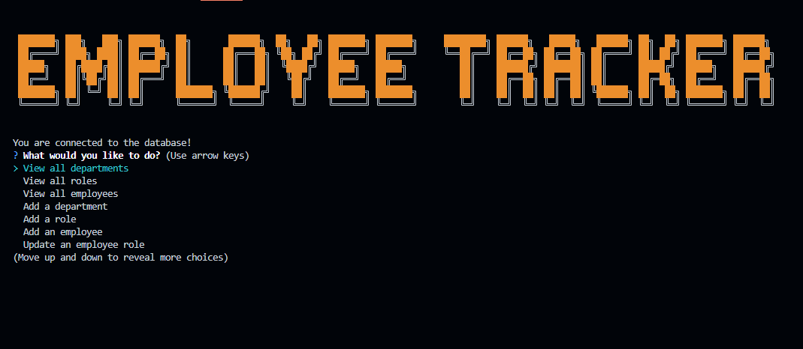

# Employee-Tracker 

  ## License: N/A
  

  ## Description:
  ### A command-line application to manage a company's employee database, using Node.js, Inquirer, and MySQL. 

  ## Table of Contents
  ### * [License](#license)
  ### * [Installation](#installation)
  ### * [Assets](#assets)
  ### * [Usage](#usage)
  ### * [Contributing](#contributing)
  ### * [Tests](#tests)
  ### * [Questions](#questions)

  ## Installation:
  ### You must Install the following for this application to function:
  ### inquirer version 2.4
  ### MySQL2
  ### CFONTS

  ## Assets:
  
  
  ### The following image demonstrates the web application's appearance and functionality:

 
  ### Link to walkthrough video for application https://drive.google.com/file/d/1ZyL0Q2pIGZLVCs94PCpt1HLnRUpGg0Nz/view      

  ## Usage:
  ### Users use interfaces called content management systems to manage a company's employee database. The user can view tables and add to department, role, and employee tables.

  ## Contributing:
  ### N/A

  ## Tests:
  ### Run the following in your terminal to test this application:
  ### N/A

  ## Questions:
  ### If you have any questions, contact me at
  ### GitHub: https://github.com/JerrickJohnson
  ### or
  ### Email: jerrickjohnson88@gmail.com